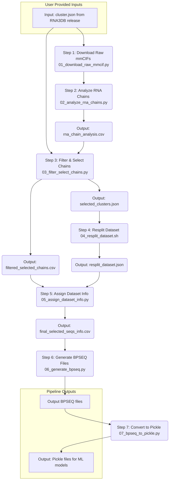

# RNA3DB-2D-Structures: RNA3DB RNA Secondary Structure Dataset Generation Pipeline

This project provides a comprehensive pipeline to process 3D RNA structures from the Protein Data Bank (PDB), as cataloged by [RNA3DB](https://github.com/marcellszi/rna3db), to generate a curated dataset of RNA secondary structures in BPSEQ format. The pipeline automates downloading mmCIF files, analyzing RNA chains using [RNApolis](https://github.com/tzok/rnapolis-py), filtering and selecting representative chains, re-splitting datasets, and finally, converting them into a 2D structure format and ML-ready pickle files.

## Features

* **Automated Workflow**: End-to-end pipeline script (`run_pipeline.sh`) for one-click execution.
* **Data Ingestion**: Downloads mmCIF files based on PDB IDs from an RNA3DB `cluster.json`.
* **RNA Chain Analysis**: Utilizes [rnapolis-py](https://github.com/tzok/rnapolis-py) for detailed 3D and 2D structure analysis of RNA chains.
* **Canonicalization**: Standardizes modified RNA residues to A, C, G, U, or N.
* **Structure Correction**: Aligns RNApolis-derived secondary structures with canonical PDB sequences.
* **Filtering & Selection**: Implements logic to filter chains (e.g., intramolecular pairing, sequence coverage) and select the best representative chain per RNA3DB cluster based on resolution and coverage.
* **Dataset Splitting**: Leverages `RNA3DB`'s splitting functionality to create train/validation/test sets from selected representative clusters.
* **BPSEQ Output**: Generates final secondary structure data in the widely used BPSEQ format, organized by dataset.
* **Machine Learning Ready**: Converts final BPSEQ data to pickle format compatible with RNA secondary structure prediction models (UFold, ERNIE-RNA, etc.).
* **Customizable**: Individual scripts can be run with different parameters, and the pipeline configuration is flexible.

## Workflow Overview

The pipeline consists of the following main steps, orchestrated by `run_pipeline.sh`:



1. **Download Raw mmCIFs (`01_download_raw_mmcif.py`)**:

   * Reads PDB IDs from the user-provided `cluster.json` (`cluster.json` can be downloaded from [RNA3DB releases](https://github.com/marcellszi/rna3db/releases)).
   * Uses `utils/batch_download.sh` to download corresponding mmCIF files (as `.cif.gz`) from RCSB.
   * Uncompresses the downloaded files to `.cif`.
2. **Analyze RNA Chains (`02_analyze_rna_chains.py`)**:

   * Processes each downloaded .cif file.
   * Uses `rnapolis-py` to identify RNA chains, parse 3D structure, and predict 2D structure (dot-bracket).
   * Extracts two key data sources:
   * * The "authoritative" canonical RNA sequences from _pdbx_poly_seq_scheme in the mmCIF file
     * The 3D structural information and predicted 2D structure (dot-bracket notation) from RNApolis
   * Performs critical sequence correction to align RNApolis-derived data with canonical sequences:

     * Maps modified nucleotides to standard A, C, G, U, or N
     * Aligns the RNApolis-derived structures to match the authoritative sequence length
     * Marks positions with missing 3D coordinates as "-" in sequence and "." in structure
     * Ensures perfect alignment between sequence and structure for downstream applications
   * Identifies base-pairing patterns (intramolecular vs. intermolecular) and pairing partners.
   * Outputs a detailed CSV (rna_chain_analysis.csv) with the original and corrected data for each RNA chain.
3. **Filter & Select Chains (`03_filter_select_chains.py`)**:

   * Loads `rna_chain_analysis.csv` and the original `cluster.json`.
   * Filters chains (e.g., intramolecular pairing, minimum sequence coverage).
   * Merges analysis data with metadata from `cluster.json`.
   * For each representative PDB cluster (`repr_pdb_chain` from `cluster.json`), selects the "best" member chain based on resolution and sequence coverage.
   * Outputs `filtered_selected_chains.csv` (all chains passing filters, with a selection mark) and `selected_clusters.json` (a subset of the original `cluster.json` containing only the representative clusters that have a selected member).
4. **Resplit Dataset (`04_resplit_dataset.sh`)**:

   * Takes `selected_clusters.json` as input.
   * Uses the `rna3db split` command-line tool to partition these selected representative clusters into `train_set`, `valid_set`, and `test_set`.
   * Outputs `resplit_dataset.json`.
5. **Assign Dataset Info (`05_assign_dataset_info.py`)**:

   * Loads `filtered_selected_chains.csv` and `resplit_dataset.json`.
   * Assigns each chain in `filtered_selected_chains.csv` to a dataset (train/valid/test) based on its `repr_pdb_chain`'s assignment in `resplit_dataset.json`.
   * Outputs `final_all_info.csv` (all filtered chains with dataset info) and `final_selected_seqs_info.csv` (only the selected representative chains with dataset info).
6. **Generate BPSEQ Files (`06_generate_bpseq.py`)**:

   * Loads `final_selected_seqs_info.csv`.
   * Converts the `Sequence_Canonical` and `Structure_Corrected` for each selected chain into BPSEQ format.
   * Saves `.bpseq` files into subdirectories named after their assigned dataset (e.g., `bpseq_files/train_set/`).
   * Optionally creates another set of BPSEQ files for sequences shorter than 600nt.
7. **Convert to Pickle (`07_bpseq_to_pickle.py`)**:

   * Reads BPSEQ files from the output directories of step 6.
   * Converts each dataset (train/valid/test) into pickle format containing:
     - One-hot encoded sequences
     - Secondary structure labels (unpaired/left-paired/right-paired)
     - Sequence lengths and names
     - Base pair information
   * Outputs `train.pickle`, `valid.pickle`, and `test.pickle` files ready for ML model training.

## Prerequisites

1. **Bash Environment**: Linux or macOS (Windows users can use WSL).
2. **Python 3.8+**: With `pip` installed.
3. **External Tools**:
   * `curl`: Required by `utils/batch_download.sh`.
4. **Python Packages**: Listed in `requirements.txt`.
   * **Additional ML Dependencies**: `numpy` for array operations (included in requirements.txt).
5. **External files**:
   * **cluster.json (optional)**: Download and extract it from the [RNA3DB release](https://github.com/marcellszi/rna3db/releases) archive  `rna3db-jsons.tar.gz`. A demo file,  [RNA3DB_2024-12-04-release_cluster.json](https://github.com/ZYZhang17/RNA3DB-2D-Structures/blob/main/data/RNA3DB_2024-12-04-release_cluster.json), is also provided, which was downloaded from the [RNA3DB 2024-12-04 release](https://github.com/marcellszi/rna3db/releases/tag/2024-12-04-full-release).

## Installation

1. **Clone the repository**:

   ```bash
   git clone https://github.com/your-username/RNA3DB-2D-Structures.git
   cd RNA3DB-2D-Structures
   ```
2. **Install Python dependencies**:
   It's highly recommended to use a virtual environment:

   ```bash
   python3 -m venv venv
   source venv/bin/activate  # On Windows: venv\Scripts\activate
   pip install -r requirements.txt
   ```
3. **Ensure `batch_download.sh` is executable**:

   ```bash
   chmod +x ./utils/batch_download.sh
   ```

## Data Preparation

1. **`cluster.json`**:

   * An example [RNA3DB_2024-12-04-release_cluster.json](https://github.com/ZYZhang17/RNA3DB-2D-Structures/blob/main/data/RNA3DB_2024-12-04-release_cluster.json) is provided in the `data/` directory by default. If you would like to use a different version of the dataset, you can either download the appropriate cluster.json file from another [RNA3DB release](https://github.com/marcellszi/rna3db/releases), or generate your own cluster.json using the official [RNA3DB](https://github.com/marcellszi/rna3db) pipeline. To use your custom dataset, place your cluster.json file in the data/ directory (or another accessible location), and then modify the `CLUSTER_JSON_PATH` variable in config/pipeline_config.sh to the path of your new file. Once updated, simply execute run_pipeline.sh to process your custom dataset through the pipeline.
   * You need an RNA3DB `cluster.json` file. This file defines the RNA 3D structure clusters.
   * You can obtain this file from an official RNA3DB release. For example, from the [RNA3DB Releases page](https://github.com/marcellszi/rna3db/releases), download the `rna3db-jsons.tar.gz` archive corresponding to a release (e.g., `2024-12-04-full-release`).
   * Extract `cluster.json` from the archive.
   * Place this `cluster.json` file in a location accessible by the pipeline (e.g., the project's `data/` directory or a custom path).
2. **`modifications_cache.json`**:

   * This file is used by `02_analyze_rna_chains.py` to map modified RNA residues to standard ones.
   * A version of this file, sourced from the [RNA3DB](https://github.com/marcellszi/rna3db) library, is already included in this project at `utils/modifications_cache.json`. The pipeline is configured to use this by default.

## Running the Pipeline

The entire pipeline can be run using the `run_pipeline.sh` script.

1. **Configure the pipeline**:

   * Copy the configuration template:
     ```bash
     cp config/pipeline_config_template.sh config/pipeline_config.sh
     ```
   * (Optional) Edit `config/pipeline_config.sh` to set the correct paths, especially:
     * `CLUSTER_JSON_PATH`: Path to your `cluster.json` file.
     * Other output directories if you wish to change them from the defaults.
     * Adjust `ANALYZE_MAX_WORKERS`, `TRAIN_RATIO`, `VALID_RATIO`, `PICKLE_MAX_LENGTH` as needed.
2. **Execute the pipeline script**:

   ```bash
   bash ./run_pipeline.sh
   ```

   The script will:

   * Load configurations from `config/pipeline_config.sh`.
   * Create necessary output directories.
   * Execute steps 01 through 07 in sequence.
   * Log progress and errors to the console and to `pipeline.log` (by default).

   Output files will be generated in the directories specified in `config/pipeline_config.sh` (e.g., `./data/downloaded_mmcif/`, `./data/analysis_output/`).

## Running Individual Scripts

You can also run individual scripts if you need to perform specific steps or debug. Each script in the `scripts/` directory accepts command-line arguments. Use the `-h` or `--help` flag for details on each script's usage.

**Example: Running `02_analyze_rna_chains.py` manually**

```bash
python ./scripts/02_analyze_rna_chains.py \
    --input_dir ./downloaded_mmcif/ \
    --output_csv ./analysis_output/my_custom_analysis.csv \
    --mod_cache ./data/modifications_cache.json \
    --log_file ./analysis_output/analyze_manual.log \
    --max_workers 4
```

**Example: Running `07_bpseq_to_pickle.py` manually for test set**

```bash
python ./scripts/07_bpseq_to_pickle.py \
    --bpseq_dir ./bpseq_files/test_set \
    --output_pickle ./analysis_output/pickle_files/test.pickle \
    --dataset_name test_set \
    --max_length 600 \
    --log_file ./analysis_output/07_bpseq_to_pickle_test.log
```

## Output Structure

* **`downloaded_mmcif/`**: Contains the downloaded and uncompressed `.cif` files.
* **`analysis_output/`**:
  * `rna_chain_analysis.csv`: Detailed analysis results from `02_analyze_rna_chains.py`.
  * `filtered_selected_chains.csv`: Output from `03_filter_select_chains.py` with all chains passing initial filters and selection marks.
  * `selected_clusters.json`: Subset of `cluster.json` used for re-splitting, from `03_filter_select_chains.py`.
  * `resplit_dataset.json`: Dataset split information from `04_resplit_dataset.sh`.
  * `final_all_info.csv`: All filtered chains with their assigned dataset.
  * `final_selected_seqs_info.csv`: Only the selected representative chains with their assigned dataset (input for BPSEQ generation).
  * `pickle_files/`: Machine learning ready pickle files

    * `train.pickle`: Training set in pickle format
    * `valid.pickle`: Validation set in pickle format
    * `test.pickle`: Test set in pickle format
    * *Note:* The default pickle files only contain RNA sequences with length  ≤ 600nt (longer sequences are filtered out). If you need to include all sequence lengths in the pickle dataset, please modify the relevant parameter (`max_length`) in `07_bpseq_to_pickle.py` or `PICKLE_MAX_LENGTH` in `run_pipeline.sh` when calling this script.
  * Log files for various steps.
* **`bpseq_files/`**:
  * `train_set/`: BPSEQ files for the training set.
  * `valid_set/`: BPSEQ files for the validation set.
  * `test_set/`: BPSEQ files for the test set.
  * (Optional) `bpseq_less600nt/`: If enabled, contains BPSEQ files for sequences < 600nt, also organized by dataset.
* **`pipeline.log`**: Main log file for `run_pipeline.sh`.

## Notes on RNA3DB Core Dataset Generation

This project focuses on processing an existing RNA3DB `cluster.json` to generate a 2D structure dataset. If you need to:

* Generate the `cluster.json` file from scratch (i.e., parse all of PDB, filter, perform sequence and structural clustering as defined by the RNA3DB methodology).
* Understand the detailed methodology behind RNA3DB's clustering and component definition.

Please refer to the official **[RNA3DB GitHub repository](https://github.com/marcellszi/rna3db)** and its documentation. The `rna3db` Python package provides the necessary tools for these tasks.

## Contributing

Contributions, bug reports, and feature requests are welcome! Please open an issue or submit a pull request.

## License

This project is licensed under the [MIT License](LICENSE).
